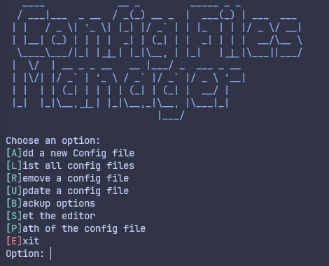

# Config Files Manager

A Pakage to manage local config files from the command line.



## Why ?

Tired of wrestling with scattered configuration files? i know i have been.
Config Files Manager is here to save the day!

- Centralized Control: Manage all your configuration files effortlessly from the command line.
- Simplified Management: Add, remove, update, and backup files with ease, no more manual headaches.
- Peace of Mind: Never worry about lost settings again – Config Files Manager has your back.
  In short, Config Files Manager is the ultimate tool for simplifying your configuration file woes.

## Features

- **Add a new Config file**: Add a new configuration file to the pakage.

- **List all config files**: Lists all the configuration files that are currently being managed by the pakage to choose from and open in the text editor.

- **Remove a config file**: Remove a configuration file from the pakage.

- **Update a config file**: Update a configuration file name or path.

- **Backup options**: Provides options for backing up your configuration files.

  - Create a backup of all config files : Create a backup of all configuration files managed by the pakage.
  - List all backup files : List all the backup files that are currently being managed by the pakage.
  - Use a backup file : Use a backup file to restore the configuration files.
  - Delete a backup file : Delete a backup file.

- **Set the editor**: Set the text editor that will be used to open configuration files.

- **Show path of the config file**: This feature shows the path of the current configuration file.

## Requirements (required)

- Node.js version 12 or higher
- NPM (Node Package Manager)

## Installation

run the following command to install the package globally

```sh
npm i -g config-files-manager
```

or for pnpm

```sh
pnpm i -g config-files-manager
```

## Usage

To use the Config Files Manager, simply run the following command in the terminal:

```sh
config-files-manager
```

or

```sh
cfm
```

## License

this project is licensed under the MIT License - see the [LICENSE](./LICENSE) file for details

## Contributing

For contributions, please refer to the [CONTRIBUTING](./CONTRIBUTING.md) file
